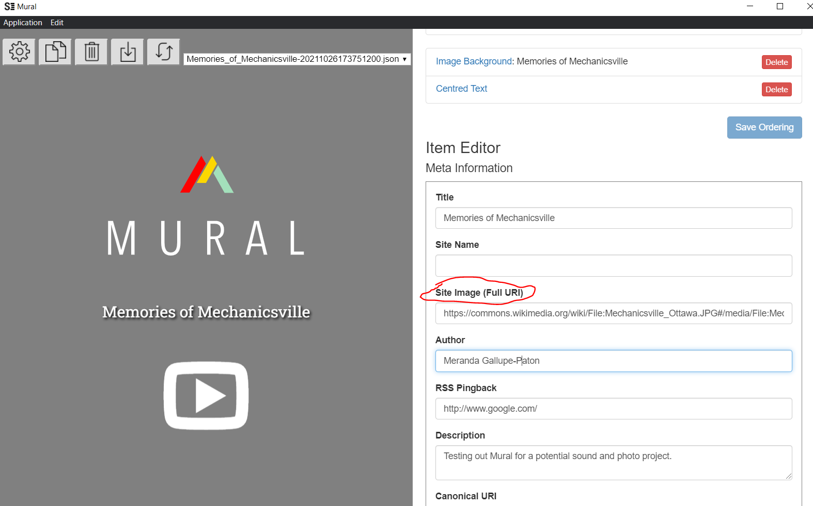

# Working on Mural Log
## Week 8 - November 14, 2021

### What was I trying to do
The main thing I wanted to do in this work session was add a photo to the landing page of my mural story and work on adding some more content to the story. 

### What I did
To add a photo to the landing page, the Mural editor asks for a "Site Image (Full URI)" (see photo below). 

For most other sections of Mural, you can simply upload content from your machine so this is the first time I've come across this. I first had to look into what a URI was to understand what I needed to give the Mural editor. It seems like this needs to be a hyperlink to a photo that exists online (this is a VERY basic understanding). What complicates this is that I don't have somewhere to host a photo for me, I've seen some suggestions that say to upload the image to websites like Flicker that can make a url for the image but I'm not keen on making another account somewhere online just for this purpose. So I went looking for photos on Google Images, just to test if it would work. I added https://commons.wikimedia.org/wiki/File:Mechanicsville_Ottawa.JPG#/media/File:Mechanicsville_Ottawa.JPG to the Mural editor (see photo above). But this didn't seem to work either. While it's not a crucial part of the project, I would still like the landing page to look nice.

### Next steps
I think this is the point where I need to reach out and ask for help to try and better understand what a URI is and how I can get one to give to the Mural editor. 
