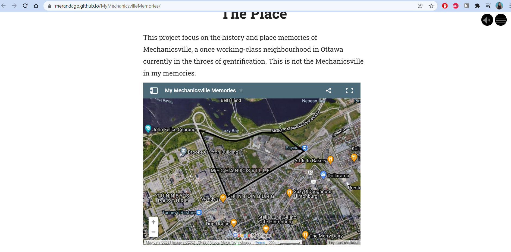

# More Working on Mural Log
## Week 8 - November 17, 2021

### What was I trying to do
Today, I worked on adding a photo to the landing page of my Mural story and started adding content to the story. 

### Landing Page Photo
After asking in the discord for help, I followed Dr. Graham's advice:
1. I added a photo to the github repo that will eventually host my Mural story which can be found here: https://github.com/merandagp/MyMechanicsvilleMemories and the actual deloyment of the site is here: https://merandagp.github.io/MyMechanicsvilleMemories/
2. I copied the url (https://github.com/merandagp/MyMechanicsvilleMemories/blob/main/Hincheyc1980.jpg?raw=true) for the photo in the repo to the Mural editor in the metadata section
3. I knew I was going to be adding more content to my story in this work session so I waited until after that to export the story and test if the image worked (spoiler, it did work!)

### Adding more content
I'm still working through a storyboard outline but wanted to work on getting at least a working introduction to the story into the Mural editor. I decided that it would be best to start the story with a title page using an Image Background element and follow it up with a Centered Text element. While working on writing the introduction, I thought it would be good to showcase on a map where Mechanicsville is. There are many ways I could go about doing this (like so many things in digital history) but I ended up going with something I am already comfortable with, Google My Maps.

From the Google Sheets-To-Maps tutorial I completed during the Digital Tune Up module, I learned how to embed a Google My Map into a static site. I used a very similar technique to embed a map into my mural story, but there were a few hiccups along the way: 
1. Created a Google My Map with an outline of the borders of Mechanicsville
2. Share the map with anyone who has the link, go to "Embed on my site" and copy the following code: <iframe src="https://www.google.com/maps/d/u/0/embed?mid=1ZgfCu_Ko2rJwbjM6-2Kj09ojY23xz_9a" width="640" height="480"></iframe>
3. Add this code to the text section in the Mural editor
4. Export the story, unzip the .zip folder with the exported Mural content, add this content to github repo and enable pages
5. This is when I noticed a slight issue, I guess in the export process, the embed code got slightly jumbled and characters were added that broke the code
6. To fix this, go into the index.HTML file in the repo and clean up the embed code 
7. Commit changes and voila!

### Adding Photos
While working, I looked into why Mural asks for multiple sizes for images. All the information is on their website [here](https://www.getmural.io/docs/image-workflow/). Essentially, the different sizes will help make the website accessible on various devices. This is something really important for me to consider if I use Mural in another capacity but for now, I want to focus on creating a proof-of-concept that can be polished later on. To save time, I won't be resizing the images I'm using but if I find myself with additional time later on, I will be sure to do so. 

### Next steps
At this point, I really need to complete a storyboard to help direct the rest of the content I'll be adding to my Mural and then populate the story. 
