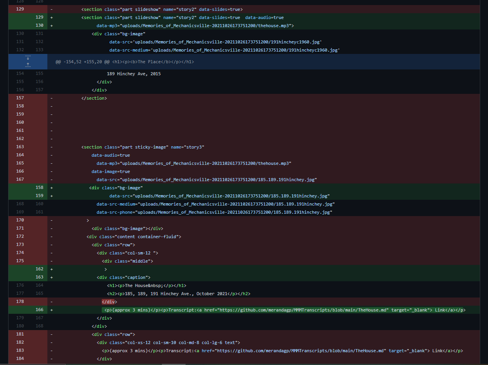

# My Mechanicsville Memories - Devlog 4
## Week 11 - November 29, 2021

### What was I trying to do
This work session was focused on tying up some loose ends and touching up some things based on some feedback and my own observations to date before going back into more content creation. 

### Embeded map - another code addition

As I've been working through some more of the finer elements of user design, I started noticing how annoying and confusing the zoom in and out feature is on the embeded map. Since Mural relies on scrolling, I've been seeing how easy it is for users to accidentally scroll on the map and completely loose where Mechanicsville is! I was also starting to question how useful the map is in The Place (Revisited) since it's purpose in the introduction is to help orient users. So after careful consideration, I removed it from the conclusion but still needed to work on the zooming in/out...

To counter act this, I found a [video](https://www.youtube.com/watch?v=RBsjk3Cuf3s&list=WL&index=31&t=29s&ab_channel=KoriAshton) that helps explain some code that I can add into the index.html doc that will remove this feature. Here is what I need to add to the iframe code: 
style="pointer-events: none;"

### Adding more movement to The House

After talking with some people who I have sent my Mural too so far, and after taking a bit of time away from the project, I looked at the story with a fresher perspective. One of the big things I'm noticing is the contrast on the user end between The House and The Street in terms of static (an audio file overtop of an image) versus dynamic (audio over a looping video). While I think both have their pros and cons, I would really like to add a bit more visual interest to The House chapter, especially since the audio file is over 3 mins in length I think it could help maintain user interest. 

There are a few ways I thought about going about this. One way I considered was making a video file with the slideshow of images over the audio file. But this was never truly what I had envisioned. What I've really wanted from the start is to have the audio play overtop of the vertical slideshow that plays before the audio (or at least that's what it used to look like). This is where I've started to see some of the confines that Mural places on creativity. While the software does a GREAT job at making website making accessible, the natural downside is that it does have limitation to what you can do. Whereas coding from scratch feels like the wild west in terms of options, Mural feels like a bike with training wheels. I felt brave today and decided to take off the training wheels slightly and open myself up to the possibility of failing gloriously...

I decided to put my pretty basic understanding of HTML to the test. I figured all the content was there just not in the right order. Here is what I changed in the index.html document: 

Essentially what I did was take the bit of code that added the audio file overtop of the image and moved it to be in the slideshow section so it would play while users scroll through the images. I also had to add the image it was playing over originally as a slide in the slideshow. For this I copy and pasted the code for one of the slides and just swapped out the image info.To my great suprise (and relief) it worked! Users can now scroll through the slideshow while The House audio file plays over all the images. 

#### Next steps
Moving forward, my plan is to go back into the Mural editor and add the image of all three houses now to the slideshow just to make my life easier down the road (I'm also planning on adding another image I recently got my hands on of the original houses coming down). Then once I have uploaded all my Mural content to github for the last time, I'll make all the html changes in one go. Here's my list so far:
1. Add volume warning on landing page
2. Add code to the Google My Maps embed to stop zooming in/out
3. Move audio track up to play over slideshow instead of over the image and then delete the image section of code to avoid being redundant.   

### Reining it in
In my last devlog, I talked about my concerns about how big this project could get. I was having a hard time outlining what narrative purpose The Park chapter was serving and ultimatly decided that it would be best to delete this chapter. Right now, the three chapters tell the story I want without it being too much or overwhelming for the audience. Editing and pairing down is tough when you're so close to the project but I think ultimatly, this choice will serve the story better.

If you want to check out the story so far, you can access it here: https://merandagp.github.io/MyMechanicsvilleMemories/
